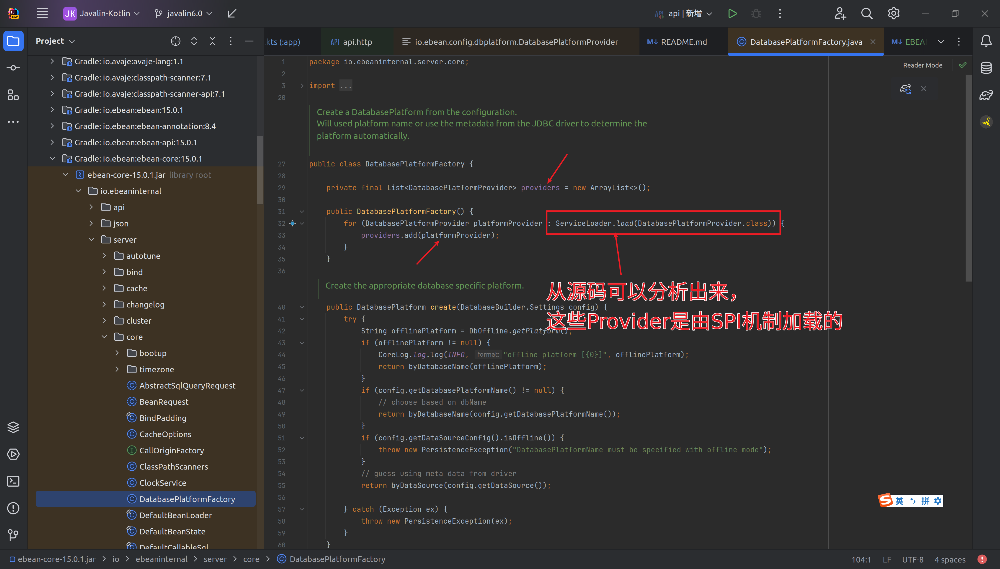
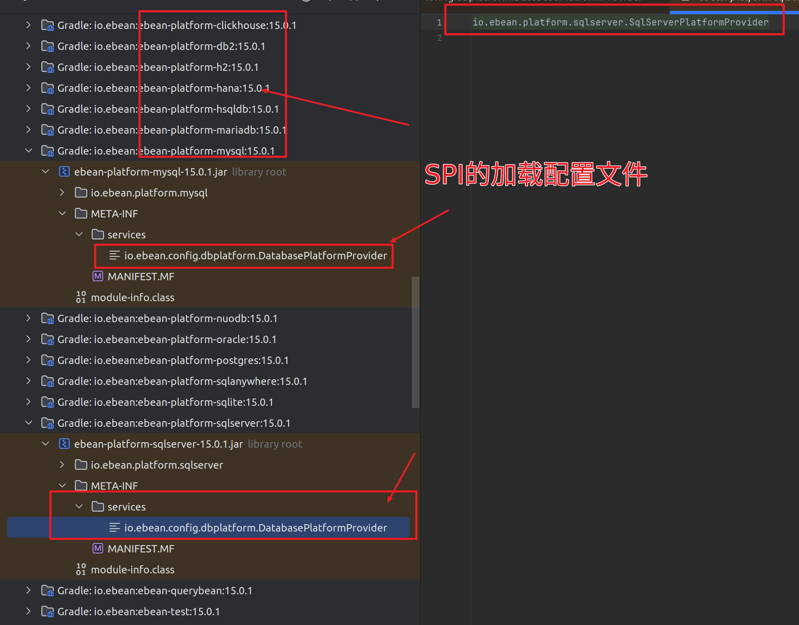
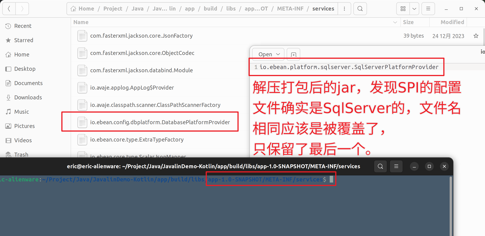
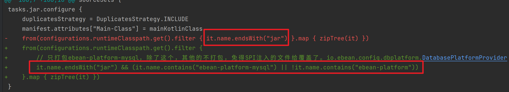

# 打包后无法启动的问题

```kotlin
12:30:45.725 kotlin [main] INFO at io . avaje . applog . slf4j . Slf4jLogger . performLog (Slf4jLogger.java:122) -ebean version : 15.0.1
12:30:45.736 kotlin [main] INFO at io . avaje . applog . slf4j . Slf4jLogger . performLog (Slf4jLogger.java:122) -Loaded properties from[resource:application.yaml]
12:30:46.273 kotlin [main] INFO at io . avaje . applog . slf4j . Slf4jLogger . performLog (Slf4jLogger.java:122) -DataSource[db] autoCommit [false] transIsolation [READ_COMMITTED] min [2] max [200] in [505 ms]
Exception in thread "main" jakarta . persistence . PersistenceException : java . lang . IllegalStateException : Unable to determine the appropriate ebean platform given database product name [mysql] and ebean platform providers[SqlServer].With ebean 13 + we now have separate platforms(
    ebean - postgres,
    ebean - mysql etc
) and should use database specific platform dependency like ebean -postgres.Note that we can use ebean -platform - all to include all the platforms .
at io . ebeaninternal . server . core . DatabasePlatformFactory . create (DatabasePlatformFactory.java:58)
at io . ebeaninternal . server . core . DefaultContainer . setDatabasePlatform (DefaultContainer.java:215)
at io . ebeaninternal . server . core . DefaultContainer . createServer (DefaultContainer.java:105)
at io . ebeaninternal . server . core . DefaultContainer . createServer (DefaultContainer.java:33)
at io . ebean . DatabaseFactory . createInternal (DatabaseFactory.java:135)
at io . ebean . DatabaseFactory . create (DatabaseFactory.java:84)
at hxy . dragon . MainKt . main $lambda$7$lambda$6(Main.kt:111)
at io . javalin . event . EventManager . fireEvent (EventManager.kt:26)
at io . javalin . jetty . JettyServer . start (JettyServer.kt:90)
at io . javalin . Javalin . start (Javalin.java:123)
at hxy . dragon . MainKt . main (Main.kt:129)
at hxy . dragon . MainKt . main (Main.kt)
Caused by : java . lang . IllegalStateException : Unable to determine the appropriate ebean platform given database product name [mysql] and ebean platform providers[SqlServer].With ebean 13 + we now have separate platforms(
    ebean - postgres,
    ebean - mysql etc
) and should use database specific platform dependency like ebean -postgres.Note that we can use ebean -platform - all to include all the platforms .
at io . ebeaninternal . server . core . DatabasePlatformFactory . byDatabaseMeta (DatabasePlatformFactory.java:104)
at io . ebeaninternal . server . core . DatabasePlatformFactory . byDataSource (DatabasePlatformFactory.java:80)
at io . ebeaninternal . server . core . DatabasePlatformFactory . create (DatabasePlatformFactory.java:55)
... 11 more
```

从上面日志分析，指定的数据库产品就是mysql，但是实际上的提供只有SqlServer。 分析代码







分析出来原因就很简单了，只要保证打包的时候，把自己需要的打包进去就好了。

```kotlin
// 打包
tasks.jar.configure {
    duplicatesStrategy = DuplicatesStrategy.INCLUDE
    manifest.attributes["Main-Class"] = mainKotlinClass
    from(configurations.runtimeClasspath.get().filter {
        // 只打包ebean-platform-mysql，除了这个，其他的不打包，免得SPI注入的文件给覆盖了。io.ebean.config.dbplatform.DatabasePlatformProvider
        it.name.endsWith("jar") && (it.name.contains("ebean-platform-mysql") || !it.name.contains("ebean-platform"))
    }.map { zipTree(it) })
}
```



这也解释了为啥IDEA，或者.gradlew run 就可以直接运行，但是打包后无法运行，原因就是services的SPI配置文件最后只有一个，还是不对应的那个。