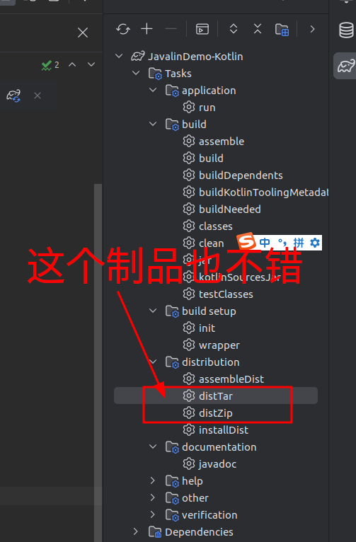
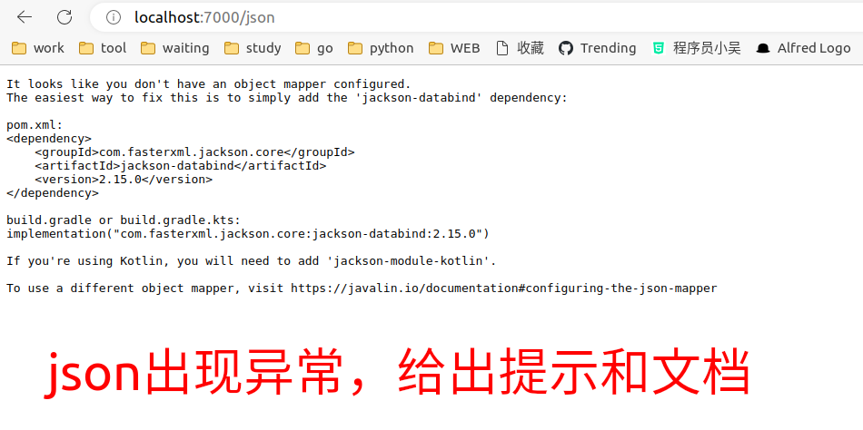
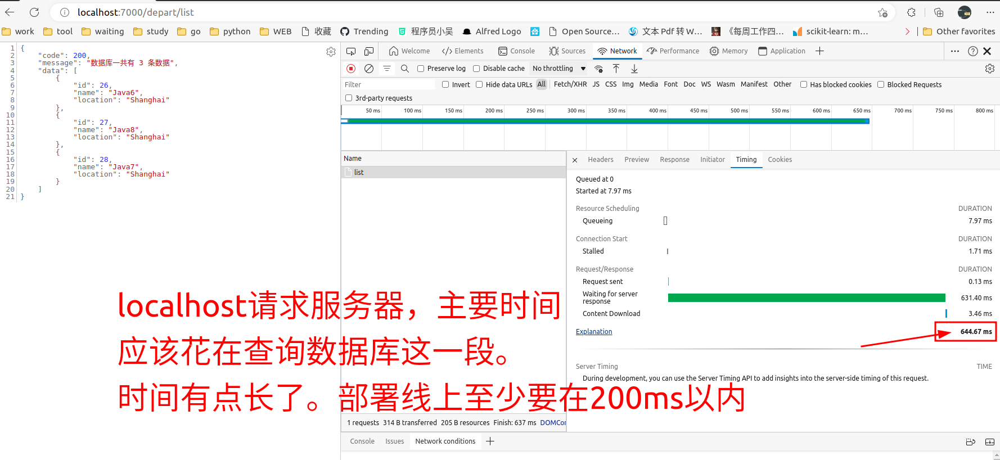
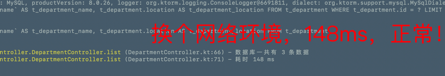

<h1 align="center" style="margin: 30px 0 30px; font-weight: bold;">Javalin for Kotlin</h1>

<p align="center">
<a href="https://gitee.com/failedgoddess/test-hub/blob/master/LICENSE"></a>
<a href="https://gitee.com/failedgoddess/test-hub"></a>
</p>

gitee: https://gitee.com/aohanhongzhi/JavalinDemo-Kotlin
github: https://github.com/aohanhongzhi/JavalinDemo-Kotlin

kotlin 也可以使用`注解`。主打 **函数式编程**。

https://kotlinlang.org/

独立的编译器下载和安装（可以不需要，一般工程会自动下载kotlin-embed-compiler）。
https://github.com/JetBrains/kotlin

Javalin与Ktorm的结合，要更好，在序列化与前端交互方便。ebean比Ktor更好，Ktor着实设计的太复杂。

Javalin 的 Route 设计上与Golang的gin 框架很类似

本项目主要实现功能如下：

1. json序列化 jackson-kotlin
2. 参数反序列化
3. 乱码解决
4. [日志实现](https://juejin.cn/post/6940302422388506632) : https://github.com/oshai/kotlin-logging
5. ORM层 https://ebean.io/
6. gradle https://docs.gradle.org/nightly/userguide/kotlin_dsl.html
   and https://docs.gradle.org/current/samples/sample_building_kotlin_applications.html

> 本项目已经非常完善了。该有的都有了。

主要技术栈

 名称      | 用途        | 官网                 
---------|-----------|--------------------
 Javalin | web       | https://javalin.io 
 ebean   | ORM层操作数据库 | https://ebean.io/  
 Gradle  | 项目构建工具    | https://gradle.org 

https://github.com/javalin/javalin

推荐使用的ORM

https://ebean.io/

https://github.com/ebean-orm/ebean

另外推荐的ORM框架，更加高级。

https://github.com/babyfish-ct/jimmer

https://babyfish-ct.gitee.io/jimmer-doc/

Ktorm不推荐使用的，写起来有点复杂。

https://www.ktorm.org/

https://github.com/kotlin-orm/ktorm

jetbrain自己的ORM，设计的也很复杂。也不推荐使用。

https://github.com/JetBrains/Exposed

# 运行

```shell
./gradlew run
```

# 打包

```shell
./gradlew jar -x test
```

https://blog.csdn.net/setlilei/article/details/123173339

另一种成熟的发行版方式



# 问题

## 序列化

不是使用kotlinx.serialize的，使用Jackson-kotlin专用的。



## 耗时

框架本身运行，性能应该比Java更好。





## 数据类报错

Cannot construct instance of

https://blog.csdn.net/xgw1010/article/details/120023159

```kotlin
    implementation("com.fasterxml.jackson.module:jackson-module-kotlin:2.12.5")
```

## ebean更新

在Ebean框架中，当使用update()
方法更新实体时，如果某个属性的值为null，则默认会将该属性的值更新为null。如果你想要在更新时忽略null值，可以使用update()
方法的重载版本，即update(Object, Set<String>)方法。该方法允许你指定哪些属性需要更新，只有指定的属性才会被更新到数据库中。

举个例子，假设你有一个名为User的实体类，其中有两个属性name和age。如果你想要更新用户的姓名，但是不想更新年龄属性，可以按照以下方式调用update()
方法：

```kotlin
User user = ...; // 获取待更新的用户实体
user.setName("New Name");
Ebean.update(user, "name"); // 只更新name属性，不更新age属性
```

这样，即使年龄属性为null，它也不会被更新到数据库中。

@Id的Field没有配置表主键无法返回id就会报错。

https://github.com/ebean-orm/ebean/issues/3100

```kotlin
Autoincrement getGeneratedKeys () returned no rows ?
javax.persistence.PersistenceException: Autoincrement getGeneratedKeys () returned no rows ?
at app//io.ebeaninternal.server.persist.dml.InsertHandler.setGeneratedKey(InsertHandler.java:139)
        at app//io.ebeaninternal.server.persist.dml.InsertHandler.getGeneratedKeys(InsertHandler.java:126)
```

# kotlin

[你可能一直在 kt 文件中写 Java 代码 | 社区分享](https://mp.weixin.qq.com/s/tVKxSA-ppk-zXYWKFYTDHA)

# 拓展

其他kotlin框架

http://www.fireflysource.com/index.html

https://github.com/hypercube1024/firefly


