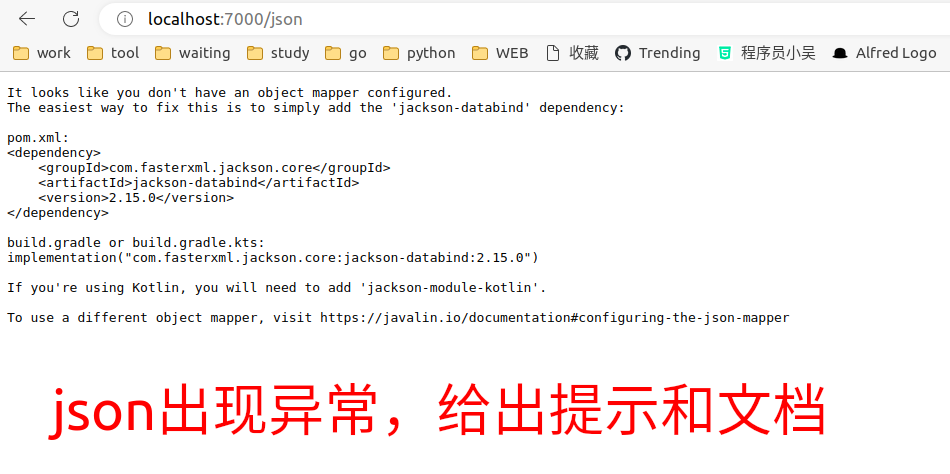
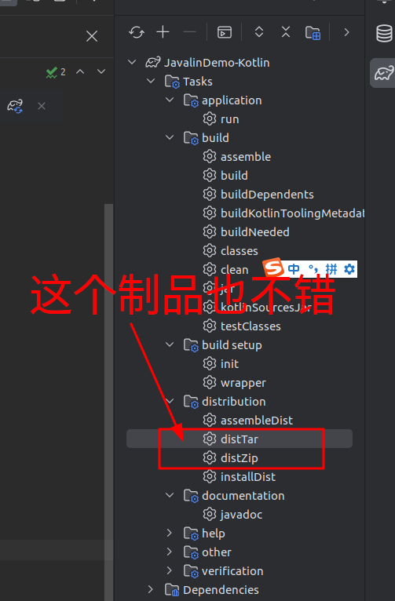

Javalin for Kotlin
===

kotlin语法 没有注解的使用。完全就是主打函数式编程。

Javalin与Ktorm的结合，要更好，在序列化与前端交互方便。比Ktor更好，这个着实设计的太复杂。

Javalin 的 Route 设计上与Golang的gin 框架很类似

本项目主要实现功能如下：

1. json序列化
2. 参数反序列化
3. 乱码解决
4. [日志实现](https://juejin.cn/post/6940302422388506632) : https://github.com/oshai/kotlin-logging
5. ORM层
   https://www.ktorm.org/

> 本项目已经非常完善了。该有的都有了。

https://github.com/kotlin-orm/ktorm

jetbrain自己的ORM，设计的也很复杂。

https://github.com/JetBrains/Exposed



# 数据类报错

Cannot construct instance of

https://blog.csdn.net/xgw1010/article/details/120023159

```kotlin
    implementation("com.fasterxml.jackson.module:jackson-module-kotlin:2.12.5")
```

# 打包

```shell
./gradlew jar
```

https://blog.csdn.net/setlilei/article/details/123173339

另一种成熟的发行版方式


